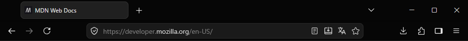

# Firefox Minima Black Theme

Tasteful black theme for Firefox

## Development

1. Optional: Install [Firefox Developer Edition](https://www.firefox.com/en-US/channel/desktop/developer/) for debugging
2. Clone this repo
3. Open Firefox (Developer Edition) and go to `about:debugging#/runtime/this-firefox`
4. Click on `Load Temporary Add-on` and select `manifest.json`
5. Test the theme; after making changes, click on **Reload** to immediately reload the theme
6. Build the .xpi file by running `node build.js`
   - You can run `node build.js clean` to remove the build artifacts

## Resources

- [Static themes on Extension Workshop](https://extensionworkshop.com/documentation/themes/static-themes/)
- [Theme syntax and properties on MDN](https://developer.mozilla.org/en-US/docs/Mozilla/Add-ons/WebExtensions/manifest.json/theme)
- [Diagram for various theme elements](https://developer.mozilla.org/en-US/docs/Mozilla/Add-ons/WebExtensions/manifest.json/theme/themes_components_annotations.png)
